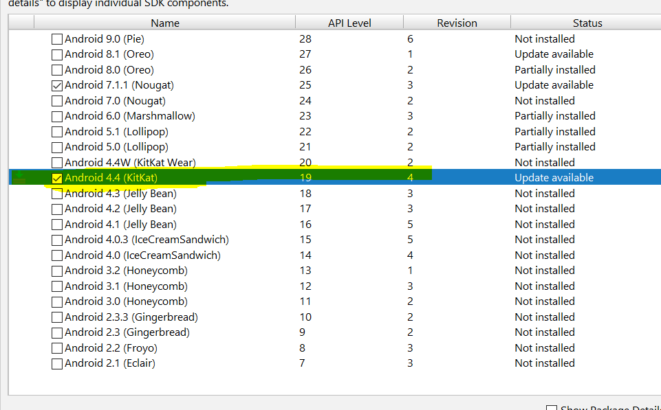

<Html>

<body>

  <h1> Kuizz Application </h1>
  
  <h3>Setting Up Android Studio</h3>
     1)  Download and Install JDK 8
          <a href = "https://www.oracle.com/technetwork/java/javase/downloads/jdk11-downloads-5066655.html"> Oracle JDK  </a> 
      2) Go the the bin Folder of the JDK and copy path. 
      3) Open System Variable and add the above path in 'path' system variable.
          3.1) Right Click On 'My Computer' 
          3.2) Select Properties. 
          3.3) From the right Option Select 'Advance System Setting' 
             
          3.4) Click on Environment Variable 
             
          3.5) Select path from System Variable and click on edit 
             
          3.6) Now Append bin path at the back of the string with ; or click on new path and paste it 
            
      4) Download and install Adnroid Studio 
          <a href = 'https://developer.android.com/studio/'>Android Studio</a> 
      5) Now Download Android SDK and tools  
          5.1 ) Click on File -> Setting  
          5.2 ) From the Left Panel , select Android SDK  
           
          5.3 ) Select SDK Platforms and check Android 7.1.1  
           
          5.4 ) Select Tools and check the following tools  
           
          5.5 ) Now hit ok and will download tools and dependency.  
     <h3> Running Application</h3>
        1) Unzip Enclosed Project  
        2) Open Android Studio and select select File - > Open and open the project 
        3) While Opening , android studio ask you to change path , click Ok 
        4) Now Android Studio will start to update and index project. 
        5) Android Studio may show error for the missing dependency in that case just click on link like this,  
           android studio will automatically download and install missing dependency 
            
        6) Connect your mobile with the computer via USB Cable 
        7) Run the program. 
           
        <h1> How To Play</h1> 
        <h3> Create your Own Quiz</h3> 
        1) Click on create Quiz 
        2) Enter title and select image of your choice 
        3) Now you can Enter your question.  
        4) Enter Question, Select Image (if any) and options, minimum two options and maximum 4 options. 
        5) Select one options and then click on ADD 
        6) After adding all the options click terminate. 
        7) Your Quiz is ready. 
        
      <h3> Playing Quiz</h3> 
      1) Click on Play 
      2) Choose your Quiz 
      3) Question screen will appear. 
      4) For each Question , you will be given 15 seconds 
      5) For each Correct Answer, you will be given 10 points 
      6) If you don't know answer of any question, click on "Show Answer" (little bulb icon) on the top.
          You will not be given any point for that question. 
      7) When you answer all the question or time is over , you will be show your final score. 
      8) You can replay the same quiz by selecting (replay) or play another quiz. 
      
     <h3> History</h3> 
      1) Your result of saved in the history. 
        
      
<body>

<Html>
